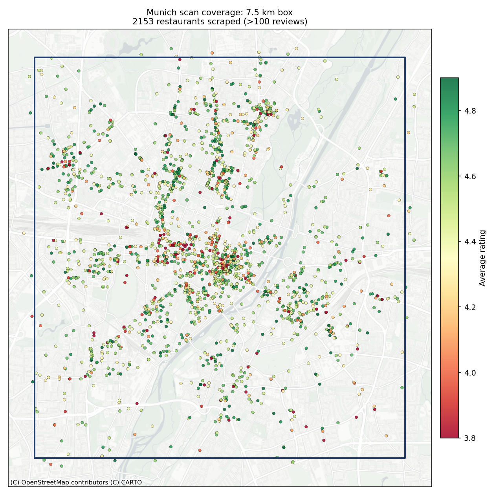
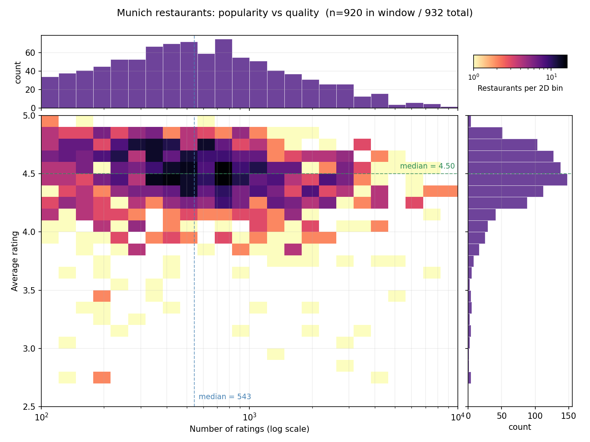
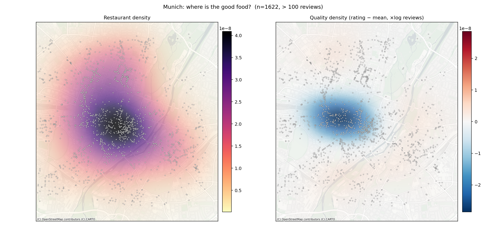
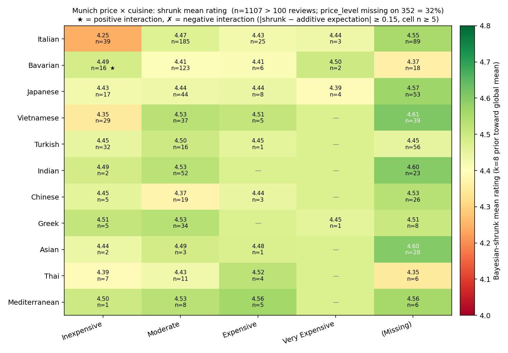

# Munich Restaurant Analysis Toolkit

A Google Places (New) scraper plus a suite of analyses, run against ~3,070
restaurants in central Munich (~2,150 with `reviews > 100`). Multi-city:
`--city berlin|vienna|hamburg` or a custom `--center` / `--side` / `--grid`.

`MIN_REVIEWS = 100` is strict (`>`) everywhere; places with exactly 100
reviews are dropped.

---

## 1. Adaptive grid scrape



A 7.5 km box around Marienplatz, tiled into 36 seed cells (6×6). Cells that
hit the API's 20-result cap subdivide into four children of half the edge and
re-query, up to `--max-depth`. The map shows 2,153 places, colored by
average rating.

Resume is built in and grid-independent. `{city}_coverage.json` records the
fully-scanned area as a union of square cells (in a local flat-meters frame
anchored at a stored reference point); `{city}_restaurants.csv` holds the
dedup'd places. Before querying a cell, the scraper skips it if its square is
already inside the covered region — so a later run with a *different*
center/box/grid reuses any overlapping ground instead of re-querying it. The
CSV is written before the coverage file (atomic tmp + `os.replace`), so a
crash never marks an area complete without its places on disk.

---

## 2. Popularity vs quality



Joint distribution of review count (log x) and rating (linear y), with
marginal projections. Three top-10 tables print alongside:

- **By rating**, filtered to `reviews > 100`.
- **By review count**, dominated by beer halls.
- **By Bayesian-shrunk rating**: `WR = v/(v+m)·R + m/(v+m)·C`. Prior `C, m`
  is computed only on the `reviews > 100` subset so tiny-N rows don't
  pollute it.

The Bayesian list surfaces 4.9-rated places with ~1,500 reviews ahead of
the 5.0s (too few reviews to shake the prior) and ahead of the 4.3-rated
beer halls (huge N can't compensate for the lower point estimate).

---

## 3. Where's the good food?



Two KDEs on a CartoDB Positron basemap. Per-pixel alpha scales with signal
magnitude so the basemap stays readable where the field is quiet.

- **Left**: density of all restaurants.
- **Right**: density weighted by `(rating − mean) × log(reviews)`. The
  center is negative (below-average quality despite high density); the
  rings to the south and west are positive.

`scipy.stats.gaussian_kde` rejects negative weights, so the signed field
is two non-negative KDEs (above-mean, below-mean) subtracted.

---

## 4. Price × cuisine



Pivot of cuisine × price tier with the per-cell Bayesian-shrunk mean
rating (prior `k=8` toward the global mean).

- **Italian "inexpensive"** scores notably below Italian overall; cheap
  pizza drags it down.
- **`price_level` is missing on 32% of places.** Google hides the price
  tag on smaller / lower-traffic restaurants, and those places have higher
  ratings on average. Surfaced as its own column rather than dropped.

---

## 5. Interactive map (HTML)

`map_html.py` writes `munich_map.html` (~3.2 MB, gitignored). Per restaurant:

- Color: Bayesian rating, clamped to [4.0, 4.8], on a selectable colormap.
- Radius: `log10(reviews)` mapped to [4, 18] px.
- Hover for tooltip, click for popup (tooltips are hidden on touch devices,
  where a tap would otherwise leave one stuck behind the popup).
- Layer toggle per cuisine.
- Colormap selector in the legend: switch the rating ramp live between
  red→yellow→green, viridis, magma, and jet. Colors are baked into per-name
  LUTs (viridis/magma/jet straight from matplotlib); each marker keeps a LUT
  index, so switching recolors all markers and the legend bar in-browser.
- `prefer_canvas=True` so 2.1k+ markers render as one canvas.

Tooltip content runs through `html.escape()` plus explicit `` ` `` and `$`
replacements: Folium emits tooltips inside JS template literals, and one
backtick in a name (e.g. "Tapas by Noah\`s") breaks the entire init script.

```bash
uv run python map_html.py
python -m http.server 8765 && open http://localhost:8765/munich_map.html
```

---

## Other scripts

- `outliers.py`: per-cuisine z-score scaled by `v/(v+m)` so tiny-N can't
  dominate; prints "most surprising for its kind" tables.

---

## Run

```bash
uv sync
export GOOGLE_MAPS_API_KEY="..."           # Places API (New) enabled

uv run python munich_grid_scrape.py --dry-run               # preview + estimate
uv run python grid_preview.py munich_grid.json              # render the seed grid on a map
uv run python munich_grid_scrape.py --max-calls 700         # scrape with budget cap

# Analyses (all free, all read the CSV):
uv run python rating_2d_hist.py
uv run python kde_quality_map.py
uv run python price_cuisine_grid.py
uv run python outliers.py
uv run python scan_coverage.py
uv run python map_html.py
```

Or regenerate every plot + the HTML map + the `docs/` Pages copy in one shot
with `make`. `make tables` runs the print-only analyses; `make clean` removes
the generated PNGs.

Multi-city:

```bash
uv run python munich_grid_scrape.py --city berlin --max-calls 700   # 13 km box, 10x10 grid (city defaults)
uv run python munich_grid_scrape.py --center 48.137,11.576 --side 8000 --grid 8
```

---

## Cost and quota

The field mask puts calls in the **Nearby Search Enterprise** SKU: $35 per
1,000 calls after a free 1,000 calls per month. A full 7.5 km Munich scrape
(36 seed tiles, adaptive subdivision) lands in the high hundreds of calls.

---

## File map

```
munich_grid_scrape.py     # scraper (multi-city CLI, atomic resume)
cuisine.py                # shared cuisine classification + MIN_REVIEWS
rating_2d_hist.py         # 2D histogram + 3 top-10 rankings
outliers.py               # cuisine-conditioned z-scores
map_html.py               # Folium interactive map
kde_quality_map.py        # geographic quality heatmap
price_cuisine_grid.py     # price × cuisine contingency
scan_coverage.py          # coverage PNG (first image)
grid_preview.py           # render a dry-run seed grid on a basemap (pre-scrape)
Makefile                  # regenerate all plots + HTML map: `make`
```

Generated artifacts (gitignored: `*_grid.json`, `*_restaurants.csv`,
`*_coverage.json`, `*.html`):

```
{city}_grid.json          # dry-run preview of the seed grid
{city}_restaurants.csv    # scraped data (resume input + output)
{city}_coverage.json      # grid-independent covered-area index for resume
munich_map.html           # interactive Folium map
```
