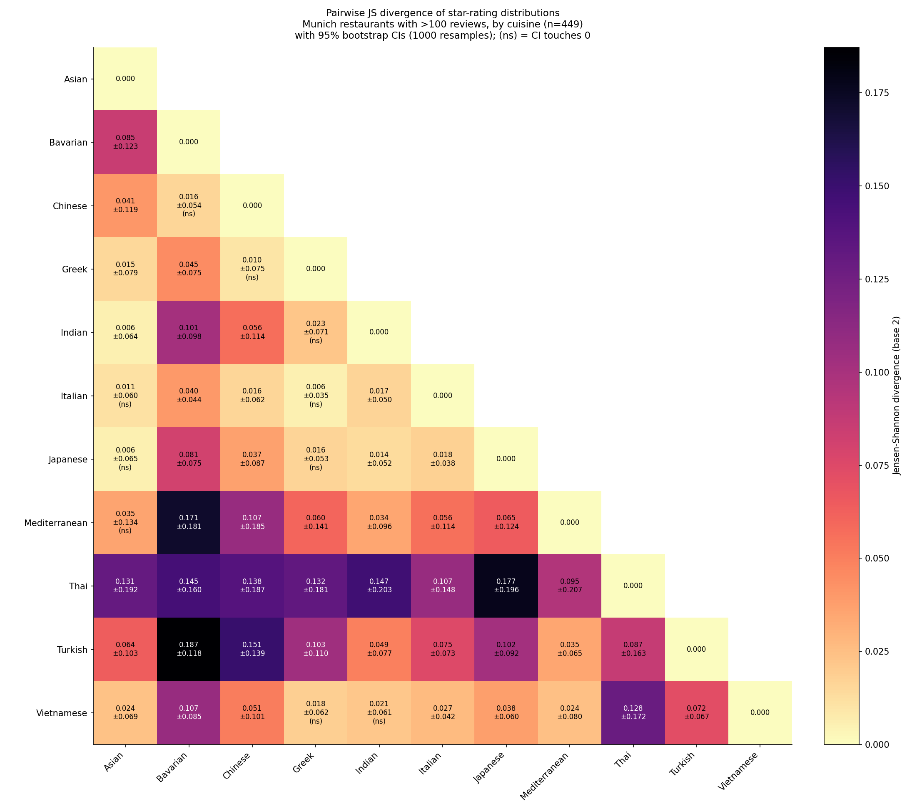

# Munich Restaurant Analysis Toolkit

A Google Places (New) scraper plus a small suite of statistical and geographic
analyses, run against ~2,200 restaurants in central Munich (~1,600 with more than
100 reviews). Multi-city ready: `--city berlin|vienna|hamburg` or supply your own
`--center` / `--side` / `--grid`.

---

## 1 — Adaptive grid scrape


A 5 km box around Marienplatz, tiled into 16 seed cells. Saturated cells (returning
the API's 20-result cap) subdivide into four children of half the edge and re-query;
this repeats up to `--max-depth`. The map above shows 1,623 places > 100 reviews,
colored by average rating.

Resume is built in: `{city}_scanned_tiles.json` records tile hashes that are *fully
scanned* (no missing results), `{city}_restaurants.csv` holds the dedup'd places.
The CSV is written first (atomic tmp + `os.replace`), then the scanned-db, so a
crash never marks a tile complete without its places on disk.

---

## 2 — Popularity vs quality


Joint distribution of review count (log x) and average rating (linear y), with
marginal projections. Three top-10 tables print alongside the PNG:

- **By rating**, filtered to `reviews > 100` — the obvious "best"
- **By review count** — popularity, dominated by beer halls
- **By Bayesian-shrunk rating** — the IMDb-style formula
  `WR = v/(v+m)·R + m/(v+m)·C`. Prior `C, m` are computed only on the
  trustworthy subset (`reviews > 100`) so tiny-N rows don't pollute it.

The Bayesian list surfaces 4.9-rated places with ~1,500 reviews ahead of the 5.0s
(which have too few reviews to shake the prior) and ahead of the 4.3-rated beer
halls (whose huge N can't compensate for the lower point estimate).

---

## 3 — Cuisine divergence



Pairwise Jensen-Shannon divergence between each cuisine's rating histogram (5
half-star bins), with bootstrap 95% CIs from 1,000 within-cuisine resamples. The
matrix is symmetric, so only the lower triangle is rendered.

- JSD = 0 ⇒ identical rating distributions
- ~0.05 and below ⇒ effectively indistinguishable at our sample sizes (flagged
  `(ns)` in the printed table when the CI lower bound is at or below 0.005)
- 0.1–0.2 ⇒ clearly different shapes

A summary table prints after the PNG: 55 pairs sorted by JSD descending, with
the CI and `(ns)` flag.

---

## 4 — Where's the good food?


Two KDEs on an OSM basemap (CartoDB Positron), with per-pixel alpha proportional
to signal magnitude so the basemap stays readable where the field is quiet:

- **Left**: density of all restaurants — concentrated around the Altstadt and
  along the main streets.
- **Right**: density weighted by `(rating − mean) × log(reviews)`. The center
  is *negative* (below-average quality despite high density) and the rings to
  the south and west are *positive*. The classic tourist-trap geography.

`scipy.stats.gaussian_kde` rejects negative weights, so the signed field is
computed as two non-negative KDEs (above-mean, below-mean) subtracted.

---

## 5 — Price × cuisine


Pivot table of cuisine × price tier with the per-cell Bayesian-shrunk mean rating
(prior `k=8` toward the global mean). Two practical takeaways:

- **Italian "inexpensive"** scores notably below Italian overall — cheap pizza
  drags it down.
- **`price_level` is missing on 35% of places.** Google appears to hide the price
  tag on smaller / lower-traffic restaurants, and those places have *higher*
  ratings on average — a real sampling story, not a bug. Surfaced as its own
  column rather than dropped.

---

## 6 — Interactive map (HTML)

`map_html.py` writes `munich_map.html` (not committed; ~1.3 MB). Per restaurant:

- Color: red→yellow→green ramp on Bayesian-weighted rating, clamped to [4.0, 4.8]
- Radius: `log10(reviews)` mapped to [4, 18] px
- Hover for tooltip, click for popup (stays until closed)
- Layer toggle per cuisine
- `prefer_canvas=True` so 1.6k+ markers render as one canvas, not 1.6k DOM nodes

Tooltip content runs through `html.escape()` plus explicit `` ` `` and `$`
replacements — Folium emits tooltips inside JS template literals, and even one
backtick in a restaurant name (e.g. "Tapas by Noah\`s") breaks the entire init
script.

```bash
uv run python map_html.py
# then either open file://.../munich_map.html, or:
python -m http.server 8765 && open http://localhost:8765/munich_map.html
```

---

## 7 — Text-only stories

These print to stdout (PrettyTable). No artifact to embed, but worth running.

- `outliers.py` — per-cuisine z-score, scaled by `v/(v+m)` so tiny-N can't
  dominate. Surfaces "most surprising for its kind" — e.g. the one 4.9 Bavarian
  that beats its cohort's 4.4 average.
- `name_tokens.py` — ridge regression of rating on tokenized restaurant names
  (ASCII-folded, freq ≥ 10) + cuisine fixed effects, weighted by `log10(reviews)`.
  Bootstrap CIs. Munich finds: `viktualienmarkt` (+0.20), `bar` (+0.09),
  `pizza` (−0.25), `restaurant` (+0.06).
- `neighborhoods.py` — DBSCAN on `(lat, lon)` projected to UTM zone 32N meters
  with `eps=80 m`, `min_samples=10`. Per cluster: count, dominant cuisines,
  modal price, mean rating. Pass `--geocode` to reverse-geocode each centroid
  (~$0.10 worth of Geocoding API calls).

---

## Run

```bash
uv sync                                    # installs the scientific stack + folium
export GOOGLE_MAPS_API_KEY="..."           # Places API (New) enabled on the project

uv run python munich_grid_scrape.py --dry-run               # see the grid + call estimate
uv run python munich_grid_scrape.py --max-calls 700         # scrape with a budget cap

# Analyses (all free, all run against the CSV):
uv run python rating_2d_hist.py
uv run python divergence_pipeline.py
uv run python kde_quality_map.py
uv run python price_cuisine_grid.py
uv run python outliers.py
uv run python neighborhoods.py
uv run python name_tokens.py
uv run python scan_coverage.py
uv run python map_html.py
```

Multi-city:

```bash
uv run python munich_grid_scrape.py --city berlin --max-calls 700
uv run python munich_grid_scrape.py --center 48.137,11.576 --side 8000 --grid 8
```

---

## Cost and quota

The field mask requests `id, displayName, rating, userRatingCount, location, types,
priceLevel`, which puts the call in the **Nearby Search Enterprise** SKU. Pricing
(verified 2026-05):

- $35 / 1,000 calls after the free monthly quota
- Free quota: **1,000 calls per month** for this SKU (no more universal $200 credit
  since Google's March 2025 pricing change)

A full 5 km Munich scrape lands around 500–700 calls (resume helps subsequent runs),
which fits inside the free tier on a quiet month. Set a budget alert in GCP; for a
hard cap, lower `SearchNearbyRequestPerDayPerProject` via the Cloud Quotas API.

---

## File map

```
munich_grid_scrape.py     # scraper (multi-city CLI, atomic resume)
divergence_pipeline.py    # JSD heatmap + bootstrap CIs + summary table
rating_2d_hist.py         # 2D histogram + 3 top-10 rankings
outliers.py               # cuisine-conditioned z-scores
map_html.py               # Folium interactive map
kde_quality_map.py        # geographic quality heatmap
price_cuisine_grid.py     # price × cuisine contingency
neighborhoods.py          # DBSCAN clusters
name_tokens.py            # name-token regression
scan_coverage.py          # coverage PNG (this README's first image)
```

Generated artifacts (gitignored: `*_grid.json`, `*_restaurants.csv`,
`*_scanned_tiles.json`, `*.html`):

```
{city}_grid.json          # dry-run preview of the seed grid
{city}_restaurants.csv    # scraped data (resume input + output)
{city}_scanned_tiles.json # tile-hash index for resume
munich_map.html           # interactive Folium map
```

---

## Caveats

- **No per-star review counts.** Google's Places API doesn't expose them; it
  returns only the average rating and total review count. JSD here operates on
  the *cuisine-level* histogram of per-place averages, not on per-review stars.
- **`MIN_REVIEWS = 100` is strict (`>`)** in every script. Places with exactly
  100 reviews are dropped.
- **The CSV is no longer pre-filtered.** Since resume landed, the scraper persists
  all dedup'd places; downstream tools apply their own `MIN_REVIEWS` gate.
  `rating_2d_hist.py` still clips visually to `X_LO = 100`, so the displayed
  histogram looks the same as it did before resume.
